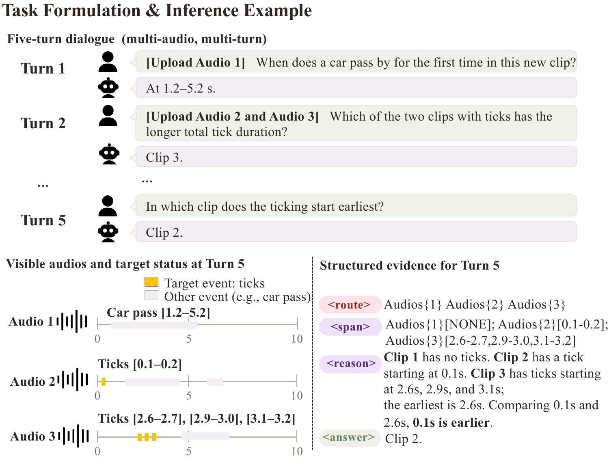

<div align="center">

# TEMA
### Evidence-Grounded Temporal Question Answering in Multi-Turn Multi-Audio Dialogues

[](https://huggingface.co/datasets/bluesky7/TEMA-Data)
[](https://huggingface.co/bluesky7/TEMA-Qwen2.5-Omni-7B-GRPO)
[](LICENSE)

[Overview](#overview) · [Data and models](#data-and-models) · [Quick start](#quick-start) · [Training](#training) · [Evaluation](#evaluation) · [Citation](#citation)

</div>

## Overview

**TEMA teaches audio-language models to recover temporal evidence and use it to answer questions across multiple recordings and dialogue turns.** A conversation can ask when a sound occurs, follow up on its duration, upload another recording, and compare the two. Each answer must stay grounded in the relevant events and their time intervals as the context changes.



TEMA generates four fields at each turn:

| Field | What it represents |
|---|---|
| **Route** | The recordings to inspect, including those where an event may be absent. |
| **Span** | Every matching event instance and its onset–offset interval; `[NONE]` marks event absence. |
| **Reason** | The instance selection, temporal calculation, or comparison needed for the question. |
| **Answer** | The final response to the user. |

Training proceeds from temporal grounding initialization (**I**) to full-dialogue supervised fine-tuning (**S**), followed by completeness-first Span-only GRPO (**G**). SFT supervises all four fields. GRPO optimizes Route and Span against event annotations, prioritizing complete instance sets and accurate boundaries. At inference, the model generates the full response.

This repository provides the **Qwen2.5-Omni-7B** training and evaluation pipeline used in our study.

### Results on TEMA-Bench

Evaluation uses 253 complete dialogues and 1,239 questions, with model-generated history carried into subsequent turns. All values below are percentages; higher is better.

| Qwen2.5-Omni-7B variant | QA | QA+T | Span F1@0.5 | H@0.1 |
|---|---:|---:|---:|---:|
| TEMA, I + S | 68.93 | 58.27 | 52.30 | 42.78 |
| TEMA, I + S + G | **69.81** | **58.76** | **58.65** | **44.39** |

QA measures question-required correctness. QA+T also checks volunteered temporal claims. Span F1 measures interval recovery, while H requires complete, correctly scoped evidence with every boundary within 0.1 seconds of its reference.

## Data and models

### Dataset

[**TEMA-Data on Hugging Face**](https://huggingface.co/datasets/bluesky7/TEMA-Data) contains the dialogue annotations, RL training data, benchmark references, and tools for resolving audio paths.

| Component | Scale | Purpose |
|---|---|---|
| TEMA-Dialog | 40,704 dialogues / 198,195 assistant turns | Full-dialogue SFT with temporal evidence and answers |
| RL data | [Download](https://huggingface.co/datasets/bluesky7/TEMA-Data/tree/main/rl) | Span-only GRPO training |
| TEMA-Bench, Test253 | 253 dialogues / 1,239 questions | Multi-turn evaluation of evidence and final answers |

Questions cover localization and measurement, event identification and verification, within-audio temporal structure, cross-audio retrieval and comparison, and references to earlier turns.

Audio is obtained separately from [AudioSet Strong](https://research.google.com/audioset/download_strong.html), [TACOS](https://github.com/OptimusPrimus/tacos), and [AudioTime](https://github.com/zeyuxie29/AudioTime). Temporal-initialization annotations are included under `temporal_init/`.

### Checkpoints

| Checkpoint | Contents | Use |
|---|---|---|
| [Temporal initialization](https://huggingface.co/bluesky7/TEMA-Qwen2.5-Omni-7B-TemporalInit) | Initialization adapter and extra state | Continue training from Qwen2.5-Omni-7B |
| [Dialogue SFT](https://huggingface.co/bluesky7/TEMA-Qwen2.5-Omni-7B-SFT) | Full merged SFT weights and original SFT adapter | SFT evaluation or the base for GRPO |
| [Span-only GRPO](https://huggingface.co/bluesky7/TEMA-Qwen2.5-Omni-7B-GRPO) | Full merged GRPO weights and original GRPO adapter | Final model and GRPO evaluation |

Evaluation loading: **original Qwen + SFT adapter** for SFT; **merged SFT + GRPO adapter** for GRPO.

## Quick start

### 1. Set up the environment

```bash
git clone https://github.com/KadeeYoung/TEMA.git
cd TEMA
```

Python 3.12 · PyTorch 2.10 / CUDA 12.8 · ms-swift 4.5.2 · vLLM 0.17.1.

```bash
python3.12 -m venv .venv
source .venv/bin/activate
python -m pip install --upgrade pip
python -m pip install 'torch==2.10.0' --index-url https://download.pytorch.org/whl/cu128
python -m pip install 'vllm==0.17.1'
python -m pip install -r requirements-runtime.txt
python -m pip install 'flash-attn==2.8.3' --no-build-isolation
python -m pip install -e . --no-deps
python -m pip install huggingface_hub
python -m pip check
```

The training runs used four A800 80GB GPUs for SFT and GRPO. The inference example below runs on one GPU; adjust `--batch-size` to the available memory. Run all commands from the repository root.

### 2. Download annotations and prepare audio

```bash
hf download bluesky7/TEMA-Data --repo-type dataset --local-dir data_release

python data_release/tools/materialize.py --release-root data_release \
  --source-root audioset_strong=/path/to/audioset_root \
  --source-root audiotime=/path/to/audiotime_root \
  --source-root tacos=/path/to/tacos_root \
  --output-root data_local --include sft rl benchmark --mode symlink
```

Replace the three source roots with directories matching `source_relative_path` in the catalog. The tool resolves locally available audio and writes JSONL with absolute audio paths; it does not download the source recordings.

### 3. Run the final model on TEMA-Bench

```bash
hf download bluesky7/TEMA-Qwen2.5-Omni-7B-SFT --local-dir models/sft
hf download bluesky7/TEMA-Qwen2.5-Omni-7B-GRPO --local-dir models/grpo

CUDA_VISIBLE_DEVICES=0 scripts/evaluate.sh --model models/sft \
  --adapter models/grpo/adapter --adapter-kind grpo \
  --data-root data_local --output outputs/grpo --batch-size 16
```

Predictions are written to `outputs/grpo/predictions.shard0.jsonl`. The model uses its own generated history at later turns.

<details>
<summary>Baseline, SFT, and multi-GPU inference</summary>

```bash
hf download Qwen/Qwen2.5-Omni-7B --local-dir models/qwen-original

# Original model: natural answers without the structured response instruction.
CUDA_VISIBLE_DEVICES=0 scripts/evaluate.sh --model models/qwen-original \
  --data-root data_local --output outputs/qwen-original --natural --batch-size 16

# SFT: original Qwen plus the original adapter and its extra-state loader.
CUDA_VISIBLE_DEVICES=0 scripts/evaluate.sh --model models/qwen-original \
  --adapter models/sft/adapter --adapter-kind sft \
  --data-root data_local --output outputs/sft --batch-size 16
```

For four-GPU inference, start four independent processes with `CUDA_VISIBLE_DEVICES=0`, `1`, `2`, and `3`. Add `--num-shards 4` and the corresponding `--shard-index 0`, `1`, `2`, or `3`, using the same output directory. Each complete dialogue stays on one GPU. Pass all four `predictions.shard*.jsonl` files to judging and metric aggregation.

</details>

## Training

Download the base model and temporal-initialization adapter:

```bash
hf download Qwen/Qwen2.5-Omni-7B --local-dir models/qwen-original
hf download bluesky7/TEMA-Qwen2.5-Omni-7B-TemporalInit --local-dir models/temporal-init

scripts/train_sft.sh --model models/qwen-original --init-adapter models/temporal-init \
  --data-root data_local --output runs/sft --gpus 0,1,2,3 --dry-run

scripts/train_grpo.sh --model models/sft --data-root data_local \
  --output runs/grpo --gpus 0,1,2,3 --dry-run
```

Remove `--dry-run` to start training. GRPO uses merged SFT weights as its base; use `python -m tema_chat.merge_lora` to export your own SFT adapter.

<details>
<summary>Temporal initialization and training parameters</summary>

To train temporal initialization from raw Qwen, prepare the 98,401 training and
500 validation examples, then run:

```bash
python data_release/tools/materialize.py --release-root data_release \
  --source-root audioset_strong=/path/to/audioset_root \
  --output-root data_local --include temporal_init --mode symlink

scripts/train_temporal_init.sh --model models/qwen-original \
  --data-root data_local --output runs/temporal_init --gpus 0,1,2,3,4,5
```

| Setting | Temporal initialization | SFT | GRPO |
|---|---:|---:|---:|
| GPUs | 6 | 4 | 4 |
| Batch per GPU × accumulation | 4 × 2 | 2 × 6 | 2 × 2 |
| Steps | 1,867 | 848 | 512 |
| Learning rate | 1e-5 | LLM 1e-5 / projector 5e-6 | 2e-5 |
| LoRA rank / alpha | 64 / 128 | 64 / 128 | 16 / 32 |

SFT continues the initialization adapter and supervises full assistant responses.
GRPO uses a fresh adapter on merged SFT weights, G=4, KL coefficient 0.04,
and an ordered 2,048-exposure schedule from 1,034 questions. Its reward is
`0.9 × H + 0.1 × D` for valid evidence and `−0.1` otherwise. Training generation
stops at `</span>`; inference generates the full response.

Full settings are in [`configs/`](configs). CPU thread defaults are OMP=8,
MKL=8, OpenBLAS=1; override with `TEMA_OMP_NUM_THREADS`, `TEMA_MKL_NUM_THREADS`,
and `TEMA_OPENBLAS_NUM_THREADS`.

</details>

## Evaluation

Evidence metrics run locally. QA and QA+T use the documented DeepSeek semantic judge together with numerical checks at an inclusive 0.1-second tolerance.

```bash
# Evidence metrics only; no API call. QA/QA+T remain null without judgments.
python -m tema_chat.metrics --predictions outputs/grpo/predictions.shard*.jsonl \
  --data-root data_local --output outputs/grpo

# Set DEEPSEEK_API_KEY in your shell before this command.
python -m tema_chat.judge --predictions outputs/grpo/predictions.shard*.jsonl \
  --data-root data_local --output outputs/grpo --workers 8

python -m tema_chat.metrics --predictions outputs/grpo/predictions.shard*.jsonl \
  --judgments outputs/grpo/dual_judgments.jsonl --data-root data_local --output outputs/grpo
```

For baseline predictions, add `--natural` to the metrics command.

<details>
<summary>Metrics and task families</summary>

| Metric | Definition |
|---|---|
| QA | Correct answer, including temporal values required by the question |
| QA+T | QA correctness plus correct additional temporal claims |
| Span F1@0.5 | Micro F1 of interval matches at IoU ≥ 0.5 |
| H@0.1 | Complete Route/Span evidence: correct occurrence counts, NONE, and endpoint errors ≤ 0.1 seconds |

All 1,239 turns count in the denominator. Correct NONE contributes to H but adds
no positive intervals to Span F1. The scorer also reports whole-dialogue correctness.

| Family | Task labels | Turns |
|---|---|---:|
| F1 localization/measurement | A1, A5, A5-gap | 453 |
| F2 identification/verification | A2, A6-yes, A6-no, A16 | 463 |
| F3 within-audio temporal structure | A3, A4 | 62 |
| F4 cross-audio retrieval/comparison | A7, A8, A9, A10, A11, A13, A14 | 225 |
| F5 multi-turn temporal reference | A17, A18 | 36 |

Family metrics use saved multi-turn predictions. Macro QA weights families equally;
Span micro F1 pools interval TP, FP, and FN.

</details>

## Citation

```bibtex
@misc{yang2026tema,
  title  = {TEMA: Evidence-Grounded Temporal Question Answering in Multi-Turn Multi-Audio Dialogues},
  author = {Kaidi Yang and Hualei Wang and Zhaohui Wang and Chenxuan Wang and Hong Liu and Xiangdong Wang},
  year   = {2026},
  url    = {https://github.com/KadeeYoung/TEMA}
}
```

## Acknowledgments

TEMA builds on [Qwen2.5-Omni](https://huggingface.co/Qwen/Qwen2.5-Omni-7B), [MS-Swift](https://github.com/modelscope/ms-swift), and the temporal grounding data introduced by [TimeAudio](https://github.com/lysanderism/TimeAudio).

Qwen2.5-Omni and MS-Swift are released under Apache-2.0. Other dependencies and source datasets retain their respective licenses.
